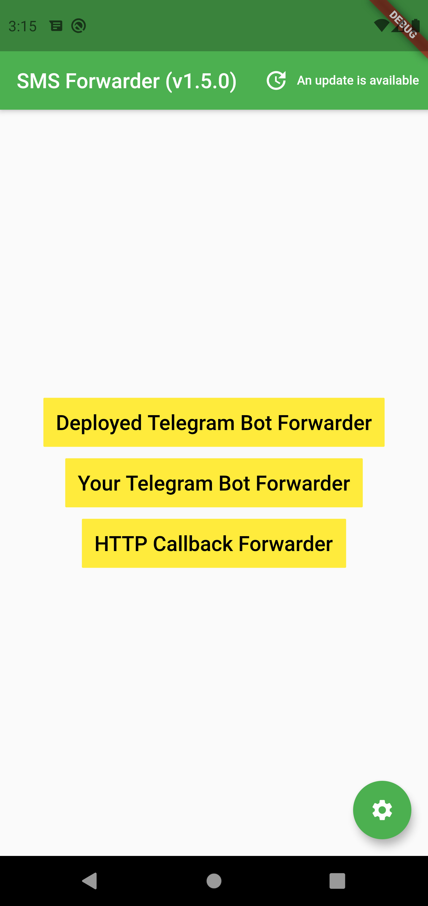
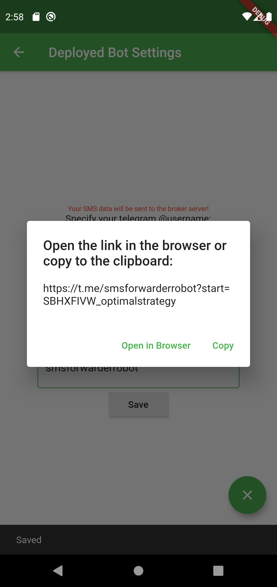
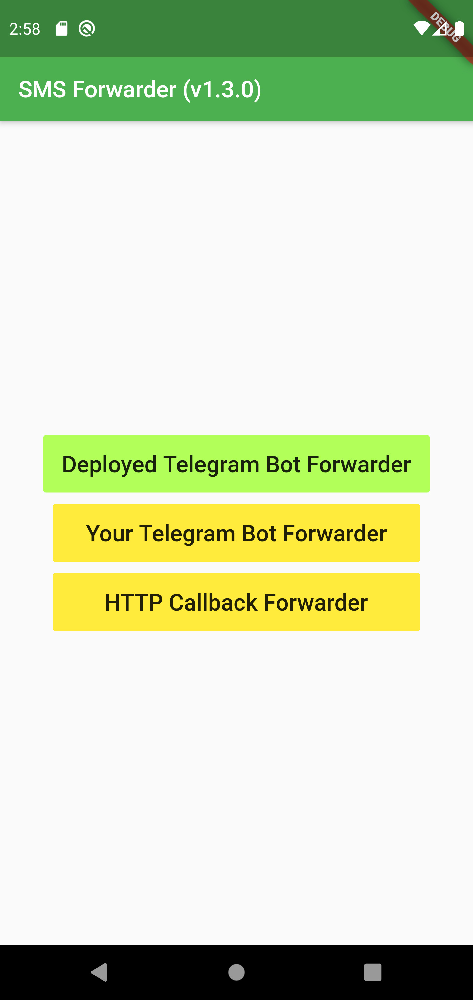
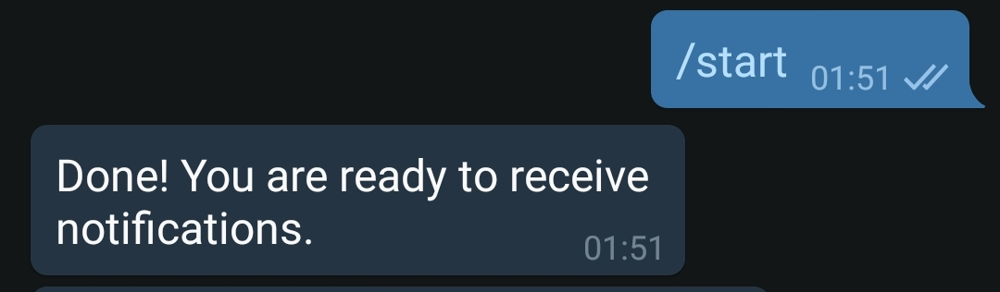
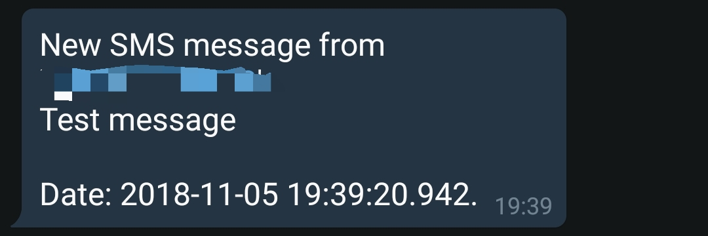
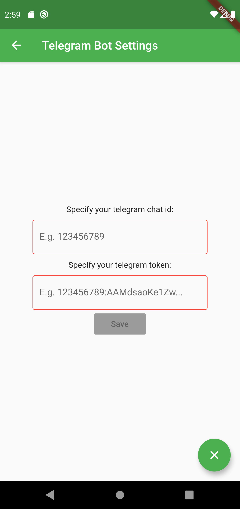
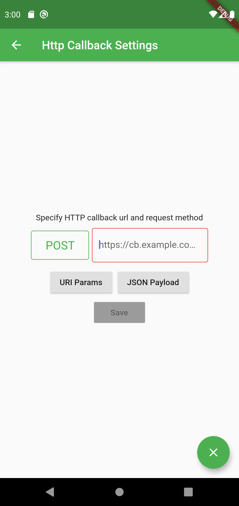
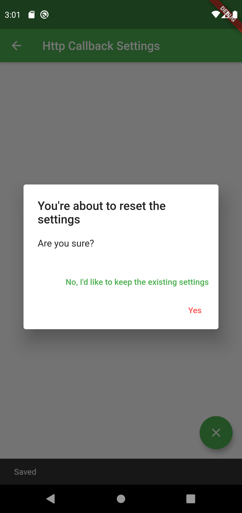

# SMS forwarder app
I have two phones: primary and the other one just to receive SMS messages. Carrying and using two 
phones at once is such a pain, that's why I coded this app.

# Installation
1. Simply download and install `sms_forwarder.apk` from the lateset [release](https://github.com/OptimalStrategy/sms_forwarder_app/releases).

## Development and building 
1. Install [flutter](https://flutter.io/docs/get-started/install)
2. Follow instructions on [this page](https://flutter.io/docs/deployment/android)

## The app supports 3 ways to forward your SMS messages:
1. Using [deployed telegram bot](https://github.com/OptimalStrategy/sms_forwarder_bot)
2. Using your own telegram bot
3. Using HTTP callback

  

## Way #1 - Deployed bot
You can forward messages using a deployed bot.
 I've deployed one for personal usage (but you can use it too), the default field values are its data. 
If you don't trust me (or anybody else), feel free to clone the [bot repo](https://github.com/OptimalStrategy/sms_forwarder_bot) and deploy it yourself.
 Here is a picture of the interface:

 You just need to fill out the login field (and other ones in case you've deployed your own bot).

Then press `Save` and open generated link in the browser or telegram app. The button in the main menu becomes green.

   

 You'll receive a confirmation from the bot, and now forwarding works!

## Way #2 - Your telegram bot
In this case you'll need a bot token + your telegram chat id. 
You can read how to get these [here](https://core.telegram.org/bots).

  

## Way #3 - HTTP callback
The app can forward messages to your http endpoint. Simply put the callback address and press save:

  

## Managing the settings
You can reset settings by pressing this little round button at the down right. 
Tapping accept will do the thing and will also turn off forwarding.

  

