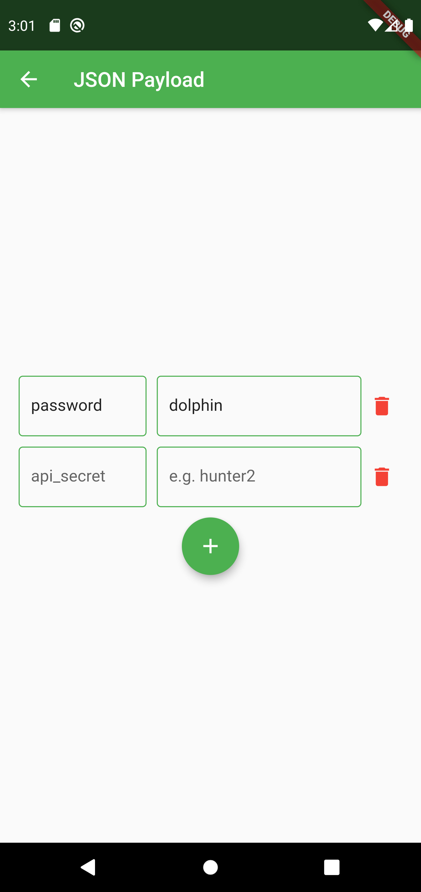
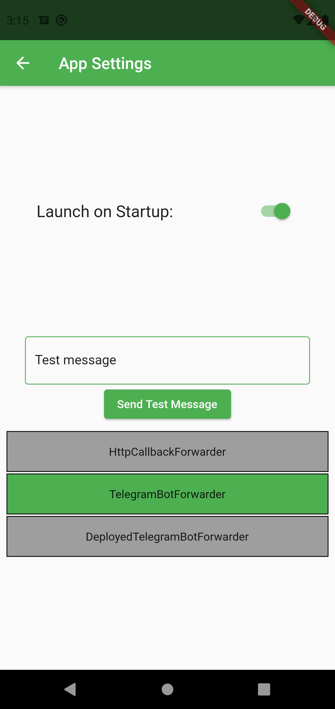

# SMS Forwarder App
This app can forward SMS messages to a Telegram bot or an HTTP endpoint.

# Installation
1. Simply download and install `sms_forwarder.apk` from the lateset [release](https://github.com/OptimalStrategy/sms_forwarder_app/releases).

## Development and Building
1. Install [flutter](https://flutter.io/docs/get-started/install)
2. Follow the instructions on [this page](https://flutter.io/docs/deployment/android)

## Forwarding Options
1. Using a [deployed telegram bot](https://github.com/OptimalStrategy/sms_forwarder_bot)
2. Using your own telegram bot
3. Using an HTTP callback

  

## Option #1 - Deployed Bot
You can forward the messages using a deployed bot.
 I've deployed one for personal usage (but you can use it too), the default field values contain its data.
If you don't trust me (or anybody else), feel free to clone the [bot repo](https://github.com/OptimalStrategy/sms_forwarder_bot) and deploy it yourself.
 Here is a picture of the interface:

 You just need to fill out the login field (and the other ones in case you've deployed your own bot).

Then press `Save` and open the generated link in the browser or the telegram app. The button in the main menu becomes green.

   

 You'll receive a confirmation from the bot, and now forwarding works!

## Option #2 - Your Telegram Bot
In this case you'll need a bot token + your telegram chat id.
You can read how to get these [here](https://core.telegram.org/bots).

  

## Option #3 - HTTP Callback
The app can forward messages to your http endpoint -- simply provide the callback address and press save. 
You may additionally specify the desired HTTP method, URI parameters, and a JSON payload.

  

  

## Managing Settings
You can reset the settings by pressing the green round button in the bottom right corner.
Tap accept to confirm. This will also turn off forwarding.

  

## Global Settings and Launch on Startup
By default, the app will automatically launch on startup.
This option can be disabled in the global app settings that can be accessed by tapping the gear icon:

  

